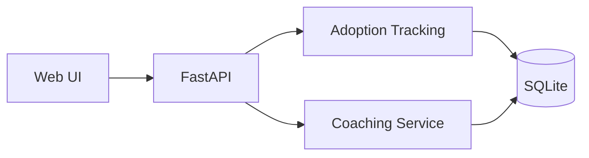

Author:  Chris Brennan

Company: Brennan Technologies, LLC

Email:   chris@brennantechnologies.com

Web:     https://www.brennantechnologies.com


# Copilot Adoption Agent

A lightweight project that helps drive Microsoft Copilot adoption across teams.

## What It Does

- Teaches employees effective Copilot usage.
- Recommends role-based prompts.
- Tracks adoption events by user and department.
- Suggests skill-level training paths.
- Provides practical coaching guidance tied to user goals.

## Architecture



## API Endpoints

- `GET /health`
- `POST /api/coach`
- `POST /api/adoption/events`
- `GET /api/adoption/metrics`

All API routes except `/health` require header:
- `X-API-Key`

## Run Locally

```powershell
python -m venv .venv
.\.venv\Scripts\Activate.ps1
pip install -r requirements.txt
copy .env.example .env
uvicorn app.main:app --reload --port 8040
```

Open: `http://localhost:8040`

## Notes

- Data is stored in `data/adoption.db`.
- Prompt recommendations are role-based and easy to extend in `app/services/coach.py`.
- The UI includes your requested table/link styling.
