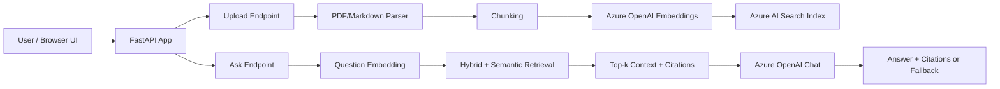

# Enterprise Document RAG Assistant

A polished Retrieval-Augmented Generation (RAG) assistant for controlled enterprise documents.

## What It Does

- Uploads and indexes `.pdf` and `.md` files.
- Uses Azure OpenAI for embeddings + answer generation.
- Uses Azure AI Search for hybrid + semantic retrieval.
- Returns grounded answers with citations.
- Enforces fallback behavior: `I don't know based on the documents.` when evidence is insufficient.

## Architecture (Short)



## Identity Model

Current implementation supports:
- `DefaultAzureCredential` for Azure OpenAI and Azure AI Search (recommended).
- API key fallback using environment variables (for local bootstrap only).

Planned/production identity model:
1. Deploy FastAPI to Azure App Service with System-Assigned Managed Identity.
2. Grant identity:
   - `Cognitive Services OpenAI User` on Azure OpenAI resource.
   - `Search Index Data Contributor` and `Search Service Contributor` on Azure AI Search as required.
3. Remove API keys from runtime config and rely fully on Entra ID.

## Endpoints

- `GET /health`
- `POST /documents/upload` (multipart files: `.pdf`, `.md`)
- `POST /ask` body: `{ "question": "..." }`

## Local Run

1. Create and activate venv:

```powershell
python -m venv .venv
.\.venv\Scripts\Activate.ps1
```

2. Install dependencies:

```powershell
pip install -r requirements.txt
```

3. Configure environment:

```powershell
copy .env.example .env
# Fill Azure endpoints/deployments and optionally API keys
```

4. Start app:

```powershell
uvicorn app.main:app --reload --port 8008
```

5. Open:
- `http://localhost:8008`

## Notes

- Index is auto-created on startup if missing.
- Uploaded files are stored under `uploads/`.
- If retrieval scores are below threshold, response is exactly:
  `I don't know based on the documents.`
