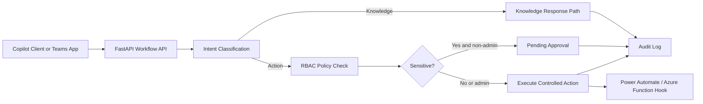

Author:  Chris Brennan

Company: Brennan Technologies, LLC

Email:   chris@brennantechnologies.com

Web:     https://www.brennantechnologies.com


# M365 Copilot Agent Workflow

A practical project template for building Microsoft 365 Copilot-style agent workflows with controlled actions, governance guardrails, and enterprise integration hooks.

## What This Project Includes

- Workflow API built with FastAPI.
- Intent routing: knowledge queries vs action requests.
- RBAC checks using `viewer`, `operator`, `admin`.
- Approval gate for sensitive actions.
- Integration hooks for Power Automate and Azure Function.
- Immutable-style audit trail for every workflow step.
- Demo request script for end-to-end testing.

## Architecture



## API Endpoints

- `GET /health`
- `POST /workflow/run`
- `GET /workflow/audit`

## Headers Required

- `X-API-Key`
- `X-User-Id`
- `X-Role` (`viewer` | `operator` | `admin`)

## Run Locally

```powershell
python -m venv .venv
.\.venv\Scripts\Activate.ps1
pip install -r requirements.txt
copy .env.example .env
uvicorn app.main:app --reload --port 8020
```

## Demo

Use [scripts/demo_requests.http](scripts/demo_requests.http).

## Notes for Real M365 Deployment

- Connect the execution step to Graph or internal APIs behind Azure Functions.
- Move auth to Entra ID + app roles instead of static API key.
- Persist audit events to Log Analytics / Application Insights / SIEM.
- Front this API with Copilot Studio actions or Power Automate flows.
