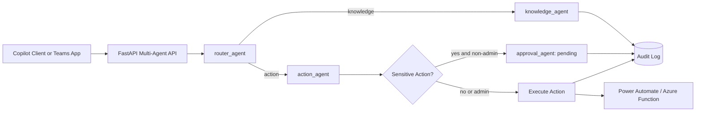

Author:  Chris Brennan

Company: Brennan Technologies, LLC

Email:   chris@brennantechnologies.com

Web:     https://www.brennantechnologies.com


# M365 Copilot Multi-Agent Workflow

A ready-to-run project template for building Microsoft 365 Copilot multi-agent workflows with orchestration, controlled actions, RBAC, and audit logging.

## Included Agents

- router_agent: intent classification and routing
- knowledge_agent: governance answer path with citations
- action_agent: controlled action execution + integration notifications
- approval_agent: sensitive action gate

## Architecture



## Endpoints

- GET /health
- POST /workflow/run
- GET /workflow/audit

## Request Headers

- X-API-Key
- X-User-Id
- X-Role (viewer, operator, admin)

## Quick Start

```powershell
python -m venv .venv
.\.venv\Scripts\Activate.ps1
pip install -r requirements.txt
copy .env.example .env
uvicorn app.main:app --reload --port 8030
```

## Demo Script

Use scripts/demo_requests.http to test:
- knowledge Q&A
- non-sensitive action execution
- sensitive action approval gating
- audit trail retrieval

## File Layout

- app/main.py
- app/services/orchestrator.py
- app/agents/
- workflows/multi_agent_workflow.json
- knowledge/governance.md
- scripts/demo_requests.http
