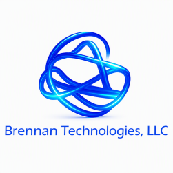
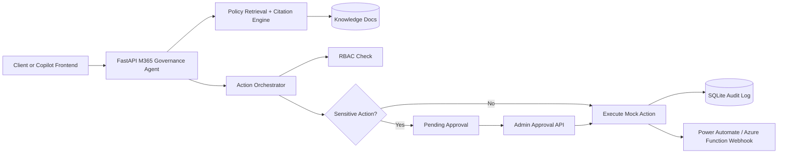

Author:  Chris Brennan

Company: Brennan Technologies, LLC

Email:   chris@brennantechnologies.com

Web:     https://www.brennantechnologies.com

# M365 Governance Agent

A production-style agent project that answers governance questions and performs controlled actions with approvals, RBAC, and audit logging.

## Scope

- Knowledge: M365/SharePoint governance policy docs in `knowledge/`.
- Actions:
  - `create_task`
  - `send_notification`
  - `generate_remediation_summary`
  - `call_mock_graph_endpoint` (sensitive)
- Integration: webhook calls to Power Automate and/or Azure Function.
- Governance controls:
  - logs every action to SQLite
  - approval workflow for sensitive actions
  - RBAC enforcement (`viewer`, `operator`, `admin`)

## Architecture



## Security and RBAC

- API key auth is required via `X-API-Key`.
- Identity context is passed with `X-User-Id` and `X-Role`.
- Role permissions:
  - `viewer`: question answering only
  - `operator`: non-sensitive actions
  - `admin`: approval and all actions
- Sensitive action policy:
  - `call_mock_graph_endpoint` requires admin approval.

## Endpoints

- `GET /health`
- `POST /agent/ask`
- `POST /agent/action`
- `POST /agent/approvals/{action_id}`
- `GET /agent/actions/logs`
- `POST /mock/graph/remediate`

## Quick Start

```powershell
python -m venv .venv
.\.venv\Scripts\Activate.ps1
pip install -r requirements.txt
copy .env.example .env
uvicorn app.main:app --reload --port 8015
```

## Demo

Use [scripts/demo_requests.http](scripts/demo_requests.http) in VS Code REST Client style, or convert to curl/Postman.

## Recruiter Signal Alignment

This project demonstrates practical capability across:
- M365 governance policy grounding and explainability (citations)
- controlled agent actions with explicit approval boundaries
- Power Platform/Azure integration points (webhook-driven)
- enterprise logging, auditability, and security posture
- APIs that can front Copilot Studio, Power Automate, or custom portals
