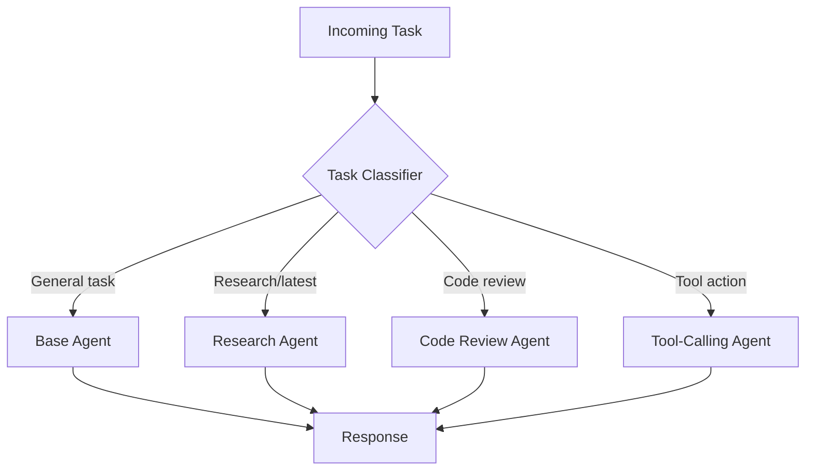
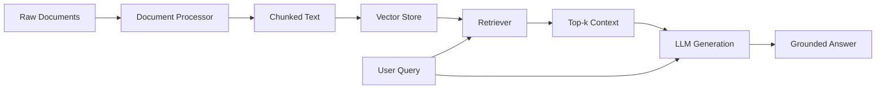
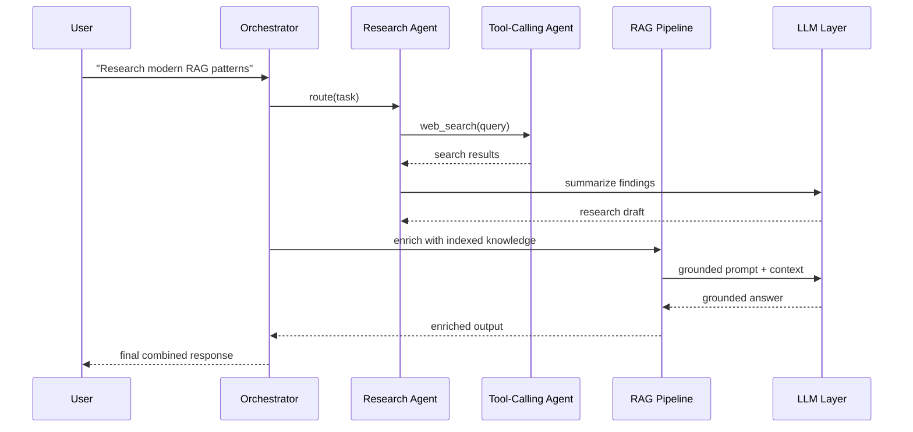
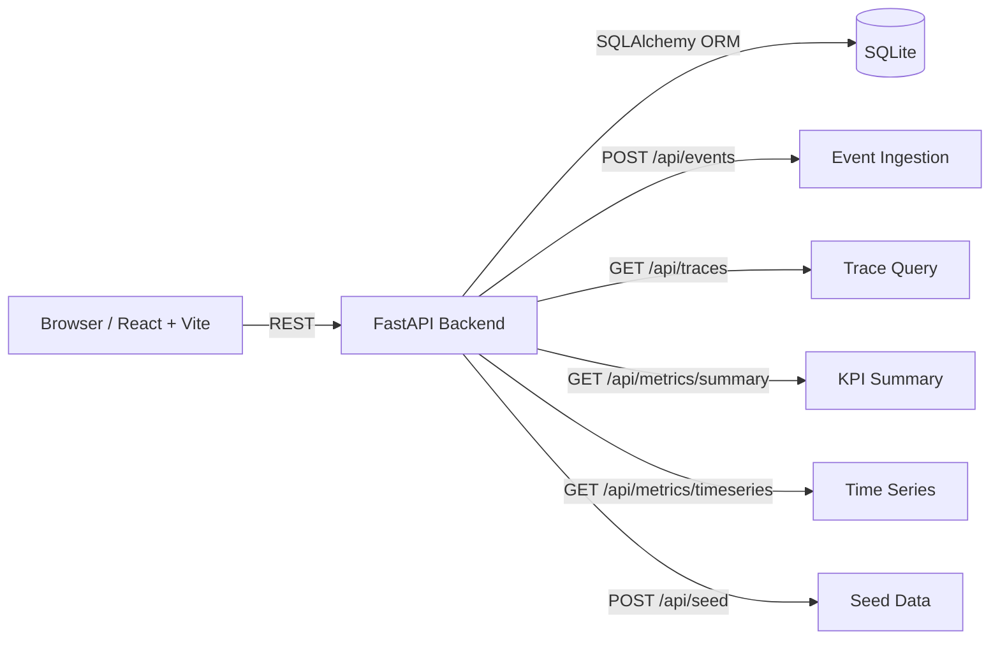
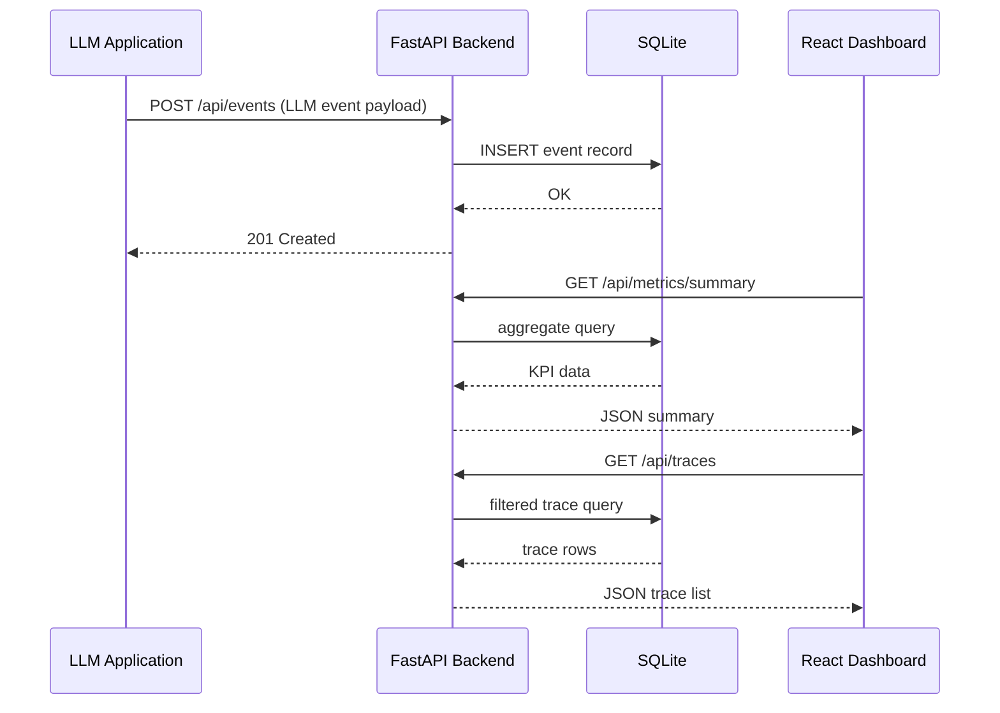

# AI.BrennanTechnologies

AI Solutions and Agents by Brennan Technologies, LLC.

This monorepo contains two independent projects for building and observing AI systems.


Author:  Chris Brennan

Company: Brennan Technologies, LLC

Email:   chris@brennantechnologies.com

Web:     https://www.brennantechnologies.com
---

## Projects

### [AI-Agents-BrennanTechnologies](./AI-Agents-BrennanTechnologies/)

A modular Python framework for building agentic AI systems.

**Key capabilities:**
- Specialized agents: Base, Research, Code Review, Tool-Calling, and Multi-Agent Orchestrator
- Retrieval-Augmented Generation (RAG) pipeline with document processing and vector search
- Provider-agnostic LLM integration (OpenAI, Anthropic, local/offline)
- Tooling layer: web search, code execution, key-value memory, vector memory
- LangGraph-style workflow orchestration with runnable examples

**Stack:** Python · LangGraph-style workflows · DuckDuckGo search · OpenAI / Anthropic / local LLM

**Quick start:**
```powershell
cd AI-Agents-BrennanTechnologies
python -m venv .venv
.\.venv\Scripts\Activate.ps1
pip install -r requirements.txt
python examples/run_base_agent.py
```

#### High-Level Architecture

```mermaid
flowchart LR
	U[User / Application] --> O[Multi-Agent Orchestrator]
	O --> A1[Base Agent]
	O --> A2[Research Agent]
	O --> A3[Code Review Agent]
	O --> A4[Tool-Calling Agent]

	A2 --> T1[Web Search Tool]
	A4 --> T2[Code Executor Tool]
	A4 --> T3[Memory Store]
	A4 --> T4[Vector Memory]

	O --> W[Workflow Graph]
	W --> R[RAG Pipeline]
	R --> DP[Document Processor]
	R --> VS[Vector Store]
	R --> RT[Retriever]

	A1 --> LLMF[LLM Factory]
	A2 --> LLMF
	A3 --> LLMF
	A4 --> LLMF
	R --> LLMF

	LLMF --> P1[OpenAI Wrapper]
	LLMF --> P2[Anthropic Wrapper]
	LLMF --> P3[Local Wrapper]
```



#### Agent Flow



#### RAG Pipeline



#### Multi-Agent Collaboration



---

### [LLM-Observability-Dashboard](./LLM-Observability-Dashboard/)

A full-stack observability dashboard for tracking LLM request health, latency, token usage, cost, and error rates.

**Key capabilities:**
- Ingest LLM events via REST API
- KPI cards: total requests, p95 latency, error rate, token usage, estimated cost
- Trace table with model/status filtering
- Latency and error-rate time-series charts
- Seed data for instant local demo

**Stack:** FastAPI · SQLAlchemy · SQLite · React · TypeScript · Vite · Recharts · Docker Compose

**Quick start (Docker):**
```bash
cd LLM-Observability-Dashboard
docker compose up --build
# Frontend: http://localhost:5173
# Backend:  http://localhost:8000
```

**Quick start (local):**
```bash
cd LLM-Observability-Dashboard/backend
python -m venv .venv && source .venv/Scripts/activate
pip install -e .
uvicorn app.main:app --reload --port 8000

# In another terminal:
cd LLM-Observability-Dashboard/frontend
npm install && npm run dev

# Seed sample data:
curl -X POST http://localhost:8000/api/seed
```

#### System Architecture



#### Request Lifecycle



---

## Repository Structure

```text
AI.BrennanTechnologies/
├── AI-Agents-BrennanTechnologies/   # Modular multi-agent & RAG framework (Python)
├── LLM-Observability-Dashboard/    # Full-stack LLM observability dashboard
│   ├── backend/                    # FastAPI + SQLAlchemy
│   └── frontend/                   # React + TypeScript + Vite
└── README.md
```
